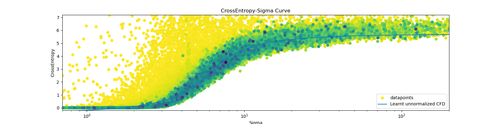

# Mini Continous Diffusion From Categorical Data

This repository aims to reproduce the [Continous Diffusion from Categorical Data paper by Dieleman et al](https://arxiv.org/pdf/2211.15089.pdf).

It is inspired by Karpathy's [nanoGPT](https://github.com/karpathy/nanoGPT) where he was able to generate coherent text with ~100M parameters.

## The Goal

The goal of this repository is to give the simplest possible reproduction of the paper. Here are some choices we made to make things simple

# Some technical decisions

- During the noising process the noise is added to all the tokens
- The tokenizer used is the BERT tokenizer (~30k vocab size)
- No self-conditioning
- We are going to train a ~100M parameter model. With [nanoGPT](https://github.com/karpathy/nanoGPT) it worked, so why not?

#### The dataset
The dataset used is [TinyStories](https://huggingface.co/datasets/roneneldan/TinyStories). It contains synthetically generated short stories by GPT-3.5 and GPT-4 that only use a small vocabulary and it weights ~1Gb.


#### Noise scheduling
In the original paper they use a monotonic [piece-wise linear function](https://en.wikipedia.org/wiki/Piecewise_linear_function) to fit the model prediction entropy $S$ as a function of the time $t$

$$S=F(t)$$

We fit $F(t)$ with a [Cauchy-like](https://en.wikipedia.org/wiki/Cauchy_distribution) cumulative distribution function as we find that it is more flexible and efficient.


#### Preconditioning

In [Elucidating the Design Space of Diffusion-Based Generative Models](https://arxiv.org/pdf/2206.00364.pdf) by Karras et al. they define the output of the model $D_\theta(\boldsymbol x,\sigma)$ as following (eq. 7 of the paper)

$$D_\theta(\boldsymbol x,\sigma)=c_\textrm{skip}(\sigma)\boldsymbol x + c_\textrm{out}(\sigma)F_\theta(c_\textrm{in}(\sigma)\boldsymbol x,c_\textrm{noise}(\sigma))$$

Where $F_\theta(\cdot)$ is the the actual Transformer and $c_\textrm{skip},c_\textrm{out},c_\textrm{in},c_\textrm{noise}$ are non-trainable modulation functions

|modulation   |Karras   |CDCD   |ours   |
|---|---|---|---|
|$c_\textrm{skip}(\sigma)$   |  $1/ (1+\sigma^2)$| ?  | $1/ (1+\sigma^2)$  |
|$c_\textrm{out}(\sigma)$  |  $\sigma/\sqrt{1+\sigma^2}$ | ?  | $\sigma/\sqrt{1+\sigma^2}$  |
|$c_\textrm{in}(\sigma)$   | $1/\sqrt{1+\sigma^2}$  | $1/\sqrt{1+\sigma^2}$  |$1/\sqrt{1+\sigma^2}$   |
|$c_\textrm{noise}(\sigma)$   | $\ln(\sigma)/4$  | ?  | $\ln(\sigma)/4$  |
> Sources: [Details in section 6.1 of the CDCD paper](https://arxiv.org/pdf/2211.15089.pdf) and [table 1 of Karras paper](https://arxiv.org/pdf/2206.00364.pdf)
> Note: Any discrepancies with the Karras paper are due to the fact that we have $\sigma_\textrm{data}=1$ because on how we initialize the input embeddings.

**_Important Note_**
We found that the choice of the modulation function has a big effect on the outcome of the training

# Training
```bash
pip install -r requirements.txt
```

The model can be trained by running the [`training.ipynb`](https://github.com/markov-bio/cdcd/blob/master/training.ipynb) notebook. Here is a quick explanation of what it does

The first cell has to do with downloading the dataset and the tokenizer
```python
dataset = load_dataset("roneneldan/TinyStories")
tokenizer = AutoTokenizer.from_pretrained("google-bert/bert-base-uncased")  # or any suitable tokenizer
[... other code ...]
```

The second cell has to do with defining the model
```python
model=DiffusionModel(embed_dim=256,
                     qkv_dim=4096,
                     num_heads=16,
                     cond_dim=64,
                     n_blocks=32,
                     vocab_size=vocab_size,
                     device=device
                     )
```

Third cell has to do with defining the optimizer
```python
optimizer = torch.optim.AdamW(model.parameters(),lr=1e-4)
lr_scheduler = [...]
```

The fourth cell has the training loop
```python
for epoch in range(num_epochs):  
    for i,tokens in enumerate(train_loader):

        noised_emb,sigma,attn_mask=model.make_sample(tokens) #makes the noised embeddings
        prediction=model(noised_emb,sigma,attn_mask)

        # Forward and backward pass
        loss = model.loss(tokens,prediction,sigma)
        loss.backward()
        optimizer.step()

        # Log, print, or save as needed
        if i%schedule_update_frequency==0 and i!=0:
            model.noise_schedule.update_optimal_parameters()

        if i%50==0 and i!=0:
            lr_scheduler.step()
            model.noise_schedule.plot_entropy_time_curve()
```
And you should see something like this



It represents the crossentropy loss of the model as a function of the noise $\sigma$ added. The more recent datapoints are colored darker.

The blue curve represents the fit of $F(t)$ (learnt unormalized CFT)

##### Comparison of the result with the CDCD paper
Checking with a ruler it seems that the curve obtained in our experiment is pretty much identical to the one obtained by the autors in the figure 2 of the CDCD paper


# Text generation

The text generation doesn't work. Here is an example of a generated sequence 64 tokens long

```
1793rone contracting palmer 06 punches whitman mcqueen fit [unused41]o signaling bradshaw meek jamaica 193val [unused459] edna survives bats neuroscience nick horns aviator morales oboe involvingets werner ale 840 ə warp introduces sculptor skins analystsmeo cale interviewing refer ensure declanmine traditionally offence © respects [unused923] pp kato stirling with faunaイ nikki tun disguised levels gregtis half chance
```

I don't know exactly why it doesn't work as of now. The CDCD paper doesn't give a precise statement of the score-interpolation technique used for generating text. Here is the algorithm used in this repository for the score interpolation

